# The Effects of COVID-19 on Worldwide Unemployment

Unemployment is a key factor when determining a country’s economic health. It is defined as people who are of age, and ability and looking for a job but have not been able to find one, and the higher the unemployment rate, the more problems a country must face. This paper focuses on the effects of Covid-19 on worldwide unemployment as we undergo the Coronavirus Pandemic and its long-lasting effects. We collected cross-country data from 2019 and 2020 to compare the before and after effects of Covid. We hope to provide a better understanding of what unemployment is, and its different types, and based on our model, we hope to offer a solution on how to overcome the adverse effects of unemployment.

Unemployment was one of the main consequences of this life-altering event. It can be defined as people who are of age, able, and looking for a job but have not been able to find one. With world-wide mandates to stay at home, those whose jobs couldn't transition to the work from home standard, suffered serious consequences. As restaurants, stores and many other businesses closed down, they had to let go of their employees. Some companies faced the economic impacts of the pandemic as revenue took a halt and cutting down expenses was the only way to stay afloat. With employees being one of the main costs a company can incur, it was expected that they would fire employees day after day. 

For this project, we chose unemployment because we believe that it is a key indicator of the economy’s health or even its future outlook. It's important to keep in mind that the higher unemployment, the less productive an economy is. If people who are of age and able to work are not doing so that means the country is not producing enough or at least not what it is capable of. In certain countries, like the United States, this also means that the state has an extra expense to consider as they need to support those unemployed. We are also interested in understanding which variables influence the unemployment rate because if we understand what variables are important, we would make more effective policies through data-driven decisions, as well as to predict how unemployment will behave in the future. The main objective of this paper is to explain how Covid-19 affected the global unemployment rates and we hope that based on our model, we can offer a solution on how to overcome the negative effects of unemployment.  


```python
import pandas as pd
import statsmodels.api as sm
import numpy as np
import matplotlib.pyplot as plt
from scipy import stats
```


```python
dset=pd.read_csv('sel_dataset.csv')
dset # set "Date" to indexes of the column
```


<div>
<style scoped>
    .dataframe tbody tr th:only-of-type {
        vertical-align: middle;
    }

    .dataframe tbody tr th {
        vertical-align: top;
    }
    
    .dataframe thead th {
        text-align: right;
    }
</style>
<table border="1" class="dataframe">
  <thead>
    <tr style="text-align: right;">
      <th></th>
      <th>Country Name</th>
      <th>Country Code</th>
      <th>unemp19</th>
      <th>unemp20</th>
      <th>GDP19</th>
      <th>GDP20</th>
      <th>pGDP19</th>
      <th>pGDP20</th>
      <th>lGDP19</th>
      <th>lGDP20</th>
      <th>...</th>
      <th>lpmanv19</th>
      <th>lpmanv20</th>
      <th>servv19</th>
      <th>servv20</th>
      <th>lserv19</th>
      <th>lserv20</th>
      <th>pserv19</th>
      <th>pserv20</th>
      <th>lpserv19</th>
      <th>lpserv20</th>
    </tr>
  </thead>
  <tbody>
    <tr>
      <th>0</th>
      <td>Africa Eastern and Southern</td>
      <td>AFE</td>
      <td>6.47</td>
      <td>6.81</td>
      <td>9.803716e+11</td>
      <td>9.008286e+11</td>
      <td>7.30</td>
      <td>7.19</td>
      <td>27.61</td>
      <td>27.53</td>
      <td>...</td>
      <td>5.00</td>
      <td>4.88</td>
      <td>4.814599e+11</td>
      <td>4.366725e+11</td>
      <td>26.90</td>
      <td>26.80</td>
      <td>729.43</td>
      <td>644.78</td>
      <td>6.59</td>
      <td>6.47</td>
    </tr>
    <tr>
      <th>1</th>
      <td>Africa Western and Central</td>
      <td>AFW</td>
      <td>5.93</td>
      <td>6.30</td>
      <td>7.920789e+11</td>
      <td>7.865850e+11</td>
      <td>7.48</td>
      <td>7.45</td>
      <td>27.40</td>
      <td>27.39</td>
      <td>...</td>
      <td>5.35</td>
      <td>5.35</td>
      <td>3.760931e+11</td>
      <td>3.532896e+11</td>
      <td>26.65</td>
      <td>26.59</td>
      <td>841.54</td>
      <td>770.02</td>
      <td>6.74</td>
      <td>6.65</td>
    </tr>
    <tr>
      <th>2</th>
      <td>Albania</td>
      <td>ALB</td>
      <td>11.47</td>
      <td>11.70</td>
      <td>1.528661e+10</td>
      <td>1.479962e+10</td>
      <td>8.59</td>
      <td>8.56</td>
      <td>23.45</td>
      <td>23.42</td>
      <td>...</td>
      <td>5.82</td>
      <td>5.78</td>
      <td>7.425612e+09</td>
      <td>7.167200e+09</td>
      <td>22.73</td>
      <td>22.69</td>
      <td>2601.65</td>
      <td>2525.67</td>
      <td>7.86</td>
      <td>7.83</td>
    </tr>
    <tr>
      <th>3</th>
      <td>Armenia</td>
      <td>ARM</td>
      <td>18.81</td>
      <td>20.21</td>
      <td>1.367280e+10</td>
      <td>1.264546e+10</td>
      <td>8.44</td>
      <td>8.36</td>
      <td>23.34</td>
      <td>23.26</td>
      <td>...</td>
      <td>6.30</td>
      <td>6.27</td>
      <td>7.415285e+09</td>
      <td>6.739570e+09</td>
      <td>22.73</td>
      <td>22.63</td>
      <td>2507.09</td>
      <td>2274.40</td>
      <td>7.83</td>
      <td>7.73</td>
    </tr>
    <tr>
      <th>4</th>
      <td>Australia</td>
      <td>AUS</td>
      <td>5.16</td>
      <td>6.61</td>
      <td>1.396567e+12</td>
      <td>1.330901e+12</td>
      <td>10.92</td>
      <td>10.86</td>
      <td>27.97</td>
      <td>27.92</td>
      <td>...</td>
      <td>8.04</td>
      <td>7.99</td>
      <td>9.221563e+11</td>
      <td>8.789295e+11</td>
      <td>27.55</td>
      <td>27.50</td>
      <td>36354.40</td>
      <td>34216.84</td>
      <td>10.50</td>
      <td>10.44</td>
    </tr>
    <tr>
      <th>...</th>
      <td>...</td>
      <td>...</td>
      <td>...</td>
      <td>...</td>
      <td>...</td>
      <td>...</td>
      <td>...</td>
      <td>...</td>
      <td>...</td>
      <td>...</td>
      <td>...</td>
      <td>...</td>
      <td>...</td>
      <td>...</td>
      <td>...</td>
      <td>...</td>
      <td>...</td>
      <td>...</td>
      <td>...</td>
      <td>...</td>
      <td>...</td>
    </tr>
    <tr>
      <th>122</th>
      <td>Uruguay</td>
      <td>URY</td>
      <td>9.35</td>
      <td>12.67</td>
      <td>6.123115e+10</td>
      <td>5.362883e+10</td>
      <td>9.78</td>
      <td>9.64</td>
      <td>24.84</td>
      <td>24.71</td>
      <td>...</td>
      <td>7.52</td>
      <td>7.37</td>
      <td>3.934694e+10</td>
      <td>3.379209e+10</td>
      <td>24.40</td>
      <td>24.24</td>
      <td>11366.26</td>
      <td>9727.91</td>
      <td>9.34</td>
      <td>9.18</td>
    </tr>
    <tr>
      <th>123</th>
      <td>Vietnam</td>
      <td>VNM</td>
      <td>2.04</td>
      <td>2.27</td>
      <td>2.619212e+11</td>
      <td>2.711584e+11</td>
      <td>7.91</td>
      <td>7.93</td>
      <td>26.29</td>
      <td>26.33</td>
      <td>...</td>
      <td>6.10</td>
      <td>6.14</td>
      <td>1.090600e+11</td>
      <td>1.128705e+11</td>
      <td>25.42</td>
      <td>25.45</td>
      <td>1130.60</td>
      <td>1159.57</td>
      <td>7.03</td>
      <td>7.06</td>
    </tr>
    <tr>
      <th>124</th>
      <td>Samoa</td>
      <td>WSM</td>
      <td>8.22</td>
      <td>8.87</td>
      <td>8.522502e+08</td>
      <td>8.070272e+08</td>
      <td>8.37</td>
      <td>8.31</td>
      <td>20.56</td>
      <td>20.51</td>
      <td>...</td>
      <td>5.57</td>
      <td>5.40</td>
      <td>6.362866e+08</td>
      <td>6.039875e+08</td>
      <td>20.27</td>
      <td>20.22</td>
      <td>3228.36</td>
      <td>3044.14</td>
      <td>8.08</td>
      <td>8.02</td>
    </tr>
    <tr>
      <th>125</th>
      <td>South Africa</td>
      <td>ZAF</td>
      <td>28.47</td>
      <td>28.74</td>
      <td>3.514316e+11</td>
      <td>3.019236e+11</td>
      <td>8.70</td>
      <td>8.54</td>
      <td>26.59</td>
      <td>26.43</td>
      <td>...</td>
      <td>6.56</td>
      <td>6.37</td>
      <td>2.150928e+11</td>
      <td>1.855286e+11</td>
      <td>26.09</td>
      <td>25.95</td>
      <td>3673.14</td>
      <td>3128.19</td>
      <td>8.21</td>
      <td>8.05</td>
    </tr>
    <tr>
      <th>126</th>
      <td>Zambia</td>
      <td>ZMB</td>
      <td>11.91</td>
      <td>12.17</td>
      <td>2.330869e+10</td>
      <td>1.932005e+10</td>
      <td>7.17</td>
      <td>6.96</td>
      <td>23.87</td>
      <td>23.68</td>
      <td>...</td>
      <td>4.48</td>
      <td>4.33</td>
      <td>1.272739e+10</td>
      <td>9.335536e+09</td>
      <td>23.27</td>
      <td>22.96</td>
      <td>712.58</td>
      <td>507.81</td>
      <td>6.57</td>
      <td>6.23</td>
    </tr>
  </tbody>
</table>
<p>127 rows × 50 columns</p>
</div>


When we first collected the raw data from the World Bank report for 2019 and 2020, our sample size was sufficient to build a reliable model as we have 166 countries' data. We mostly focused on unemployment and its different types. The Corporate Finance Institute defines unemployment as “individuals who are employable and actively seeking a job but are unable to find a job.” It is important to point out that in order to be considered unemployed, you must be of age, ability, and looking for a job. Older people, kids, or those disabled don't necessarily need to be included in this category and therefore the final unemployment rate will be altered. 


```python
def scatter_subs(data, col_1, col_2, color):
    
    """
    Break down scatterplots into different years
    """
    
    fig, ax = plt.subplots(1, 2, figsize=(8,4), sharey=True)
    
    ax[0].scatter(x=data[col_1+"19"], y=data[col_2+"19"], alpha=0.4, color=color)
    ax[1].scatter(x=data[col_1+"20"], y=data[col_2+"20"], alpha=0.4, color=color)

    print(col_2)
    print(data[col_2+'19'].mean())
    print(data[col_2+'19'].std())
    print(data[col_2+'20'].mean())
    print(data[col_2+'20'].std())

    ax[0].set_title("2019", fontsize=14, fontname="Verdana")
    ax[1].set_title("2020", fontsize=14, fontname="Verdana")

    for i in list(range(2)):
        ax[i].set_xlabel("unemployment rate")
        ax[i].set_ylabel(col_2)
```


```python
scatter_subs(data=dset, col_1="unemp", col_2="lGDP", color="orange")
scatter_subs(data=dset, col_1="unemp", col_2="gGDP", color="orange")
scatter_subs(data=dset, col_1="unemp", col_2="pGDP", color="orange")

scatter_subs(data=dset, col_1="unemp", col_2="cpi", color="orange")

scatter_subs(data=dset, col_1="unemp", col_2="ltotpop", color="orange")
scatter_subs(data=dset, col_1="unemp", col_2="prur", color="orange")
scatter_subs(data=dset, col_1="unemp", col_2="pEpop", color="orange")
scatter_subs(data=dset, col_1="unemp", col_2="educ", color="orange")

scatter_subs(data=dset, col_1="unemp", col_2="lagriv", color="orange")
scatter_subs(data=dset, col_1="unemp", col_2="lmanv", color="orange")
scatter_subs(data=dset, col_1="unemp", col_2="lserv", color="orange")

scatter_subs(data=dset, col_1="unemp", col_2="pagriv", color="orange")
scatter_subs(data=dset, col_1="unemp", col_2="pmanv", color="orange")
scatter_subs(data=dset, col_1="unemp", col_2="pserv", color="orange")

scatter_subs(data=dset, col_1="unemp", col_2="lpagriv", color="orange")
scatter_subs(data=dset, col_1="unemp", col_2="lpmanv", color="orange")
scatter_subs(data=dset, col_1="unemp", col_2="lpserv", color="orange")
```

    lGDP
    26.135511811023623
    2.445947314991992
    26.078897637795276
    2.447155533210861
    gGDP
    2.7941732283464566
    2.322411322463392
    -3.976535433070865
    4.251656517124537
    pGDP
    8.865826771653545
    1.3200904496096495
    8.797637795275595
    1.3163426103285303
    cpi
    2.8092913385826774
    2.8599065311350906
    3.5568503937007883
    8.006735924206568
    ltotpop
    17.26976377952756
    2.456279437261925
    17.280787401574802
    2.45748632908055
    prur
    38.152362204724405
    20.007374491877805
    37.78897637795276
    19.927404550479853
    pEpop
    64.11685039370079
    5.427798773449451
    64.07590551181102
    5.261597070950309
    educ
    10.035433070866143
    2.1686630933707596
    10.066929133858268
    2.186141600654618
    lagriv
    23.194251968503938
    2.544772893376763
    23.208740157480317
    2.563145696310968
    lmanv
    24.069606299212595
    2.6101065482037082
    24.006141732283464
    2.617436358512589
    lserv
    25.545275590551185
    2.4814114732622525
    25.493543307086608
    2.4796081127772758
    pagriv
    447.5115748031496
    324.75039836828137
    446.84448818897636
    293.25279101693144
    pmanv
    2164.881732283465
    3349.577930598974
    2074.40968503937
    3511.686838200013
    pserv
    9900.206535433073
    14364.11932587272
    9500.118976377951
    14183.428146048876
    lpagriv
    5.924409448818898
    0.6270574434374642
    5.928503937007874
    0.636874908277835
    lpmanv
    6.7997637795275585
    1.4061680816729414
    6.7258267716535425
    1.4071514854794824
    lpserv
    8.275039370078739
    1.4383852686180354
    8.21267716535433
    1.443116913731061


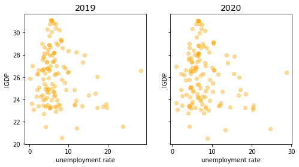
    

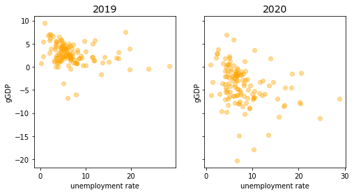

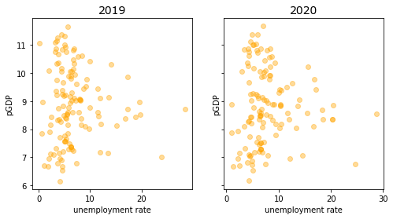

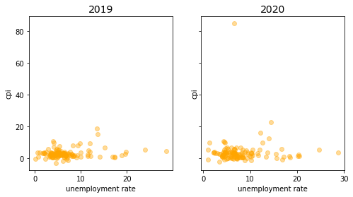

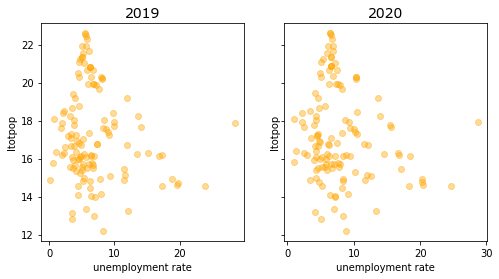

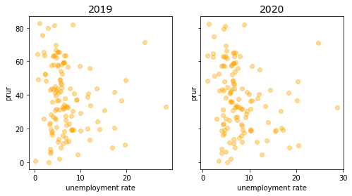

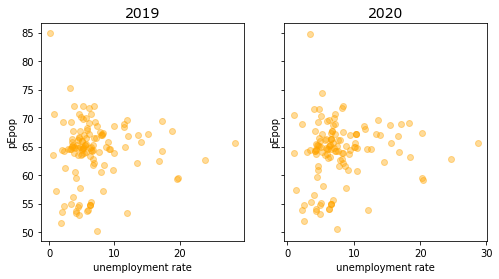

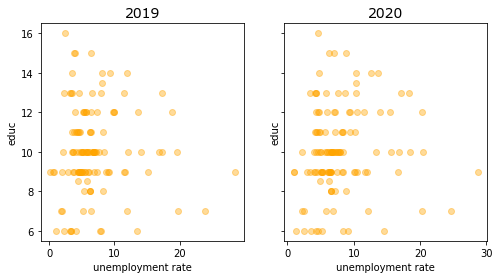

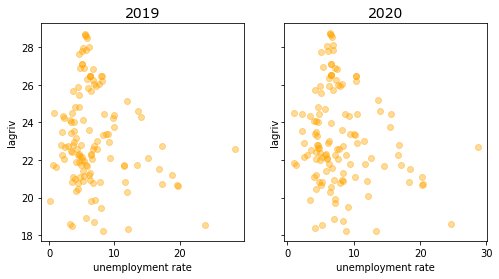

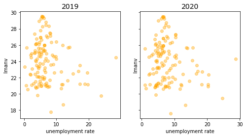

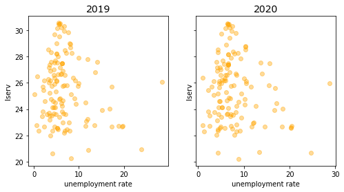

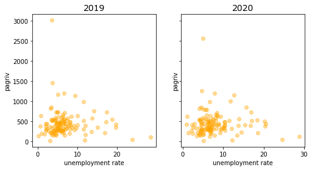

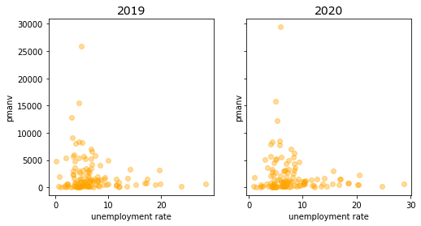

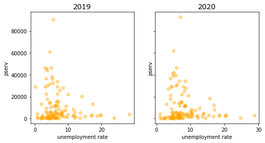

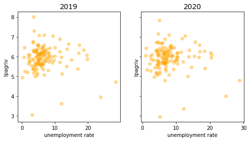

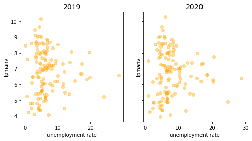

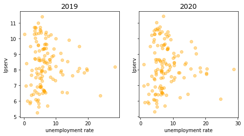


```python
dset['const'] = 1
reg=sm.OLS(endog=dset['unemp19'], exog=dset[['const','lGDP19','gGDP19','pGDP19','cpi19','ltotpop19','prur19','pEpop19','educ19','pagriv19','pmanv19','pserv19']], missing='drop')
results=reg.fit()
print(results.summary())
```

                                OLS Regression Results                            
    ==============================================================================
    Dep. Variable:                unemp19   R-squared:                       0.191
    Model:                            OLS   Adj. R-squared:                  0.113
    Method:                 Least Squares   F-statistic:                     2.464
    Date:                Wed, 08 Dec 2021   Prob (F-statistic):            0.00835
    Time:                        19:02:58   Log-Likelihood:                -359.34
    No. Observations:                 127   AIC:                             742.7
    Df Residuals:                     115   BIC:                             776.8
    Df Model:                          11                                         
    Covariance Type:            nonrobust                                         
    ==============================================================================
                     coef    std err          t      P>|t|      [0.025      0.975]
    ------------------------------------------------------------------------------
    const         19.3945      8.084      2.399      0.018       3.382      35.407
    lGDP19       -36.7477     87.569     -0.420      0.676    -210.205     136.709
    gGDP19        -0.3941      0.191     -2.063      0.041      -0.773      -0.016
    pGDP19        36.9468     87.550      0.422      0.674    -136.473     210.367
    cpi19          0.2057      0.148      1.394      0.166      -0.087       0.498
    ltotpop19     36.4120     87.563      0.416      0.678    -137.034     209.858
    prur19        -0.0570      0.034     -1.666      0.098      -0.125       0.011
    pEpop19       -0.0540      0.097     -0.558      0.578      -0.245       0.138
    educ19        -0.0929      0.198     -0.470      0.639      -0.484       0.299
    pagriv19      -0.0008      0.001     -0.559      0.578      -0.004       0.002
    pmanv19    -6.756e-05      0.000     -0.355      0.724      -0.000       0.000
    pserv19    -9.818e-05    5.4e-05     -1.817      0.072      -0.000    8.84e-06
    ==============================================================================
    Omnibus:                       57.633   Durbin-Watson:                   1.929
    Prob(Omnibus):                  0.000   Jarque-Bera (JB):              180.131
    Skew:                           1.714   Prob(JB):                     7.67e-40
    Kurtosis:                       7.721   Cond. No.                     7.03e+06
    ==============================================================================
    
    Notes:
    [1] Standard Errors assume that the covariance matrix of the errors is correctly specified.
    [2] The condition number is large, 7.03e+06. This might indicate that there are
    strong multicollinearity or other numerical problems.


```python
dset['const'] = 1
reg=sm.OLS(endog=dset['unemp19'], exog=dset[['const','lGDP19','gGDP19','pGDP19','cpi19','ltotpop19','prur19','pEpop19','educ19','lagriv19','lmanv19','lserv19']], missing='drop')
results=reg.fit()
print(results.summary())
```

                                OLS Regression Results                            
    ==============================================================================
    Dep. Variable:                unemp19   R-squared:                       0.202
    Model:                            OLS   Adj. R-squared:                  0.125
    Method:                 Least Squares   F-statistic:                     2.642
    Date:                Wed, 08 Dec 2021   Prob (F-statistic):            0.00476
    Time:                        19:03:01   Log-Likelihood:                -358.47
    No. Observations:                 127   AIC:                             740.9
    Df Residuals:                     115   BIC:                             775.1
    Df Model:                          11                                         
    Covariance Type:            nonrobust                                         
    ==============================================================================
                     coef    std err          t      P>|t|      [0.025      0.975]
    ------------------------------------------------------------------------------
    const         39.6649      9.972      3.978      0.000      19.912      59.417
    lGDP19       -66.3461     87.635     -0.757      0.451    -239.934     107.242
    gGDP19        -0.3455      0.193     -1.792      0.076      -0.728       0.037
    pGDP19        55.4592     87.244      0.636      0.526    -117.354     228.272
    cpi19          0.1442      0.146      0.985      0.327      -0.146       0.434
    ltotpop19     56.9223     87.191      0.653      0.515    -115.786     229.630
    prur19        -0.0723      0.034     -2.150      0.034      -0.139      -0.006
    pEpop19        0.0315      0.089      0.353      0.725      -0.145       0.208
    educ19        -0.1799      0.207     -0.868      0.387      -0.591       0.231
    lagriv19       0.1501      0.752      0.200      0.842      -1.340       1.640
    lmanv19        1.0680      1.018      1.049      0.296      -0.948       3.084
    lserv19        7.8418      3.203      2.448      0.016       1.497      14.187
    ==============================================================================
    Omnibus:                       54.592   Durbin-Watson:                   1.914
    Prob(Omnibus):                  0.000   Jarque-Bera (JB):              168.215
    Skew:                           1.615   Prob(JB):                     2.97e-37
    Kurtosis:                       7.621   Cond. No.                     3.69e+04
    ==============================================================================
    
    Notes:
    [1] Standard Errors assume that the covariance matrix of the errors is correctly specified.
    [2] The condition number is large, 3.69e+04. This might indicate that there are
    strong multicollinearity or other numerical problems.


```python
dset['const'] = 1
reg=sm.OLS(endog=dset['unemp19'], exog=dset[['const','lGDP19','gGDP19','pGDP19','cpi19','ltotpop19','prur19','pEpop19','educ19','lpagriv19','lpmanv19','lpserv19']], missing='drop')
results=reg.fit()
print(results.summary())
```

                                OLS Regression Results                            
    ==============================================================================
    Dep. Variable:                unemp19   R-squared:                       0.203
    Model:                            OLS   Adj. R-squared:                  0.126
    Method:                 Least Squares   F-statistic:                     2.656
    Date:                Wed, 08 Dec 2021   Prob (F-statistic):            0.00456
    Time:                        19:03:01   Log-Likelihood:                -358.41
    No. Observations:                 127   AIC:                             740.8
    Df Residuals:                     115   BIC:                             774.9
    Df Model:                          11                                         
    Covariance Type:            nonrobust                                         
    ==============================================================================
                     coef    std err          t      P>|t|      [0.025      0.975]
    ------------------------------------------------------------------------------
    const         39.8393      9.974      3.994      0.000      20.083      59.595
    lGDP19       -63.6677     87.434     -0.728      0.468    -236.858     109.522
    gGDP19        -0.3455      0.193     -1.793      0.076      -0.727       0.036
    pGDP19        52.6861     87.095      0.605      0.546    -119.832     225.204
    cpi19          0.1436      0.146      0.981      0.329      -0.146       0.433
    ltotpop19     63.3025     87.424      0.724      0.470    -109.867     236.472
    prur19        -0.0722      0.034     -2.147      0.034      -0.139      -0.006
    pEpop19        0.0300      0.089      0.336      0.738      -0.147       0.207
    educ19        -0.1814      0.207     -0.875      0.383      -0.592       0.229
    lpagriv19      0.1638      0.753      0.217      0.828      -1.329       1.656
    lpmanv19       1.0923      1.019      1.072      0.286      -0.926       3.110
    lpserv19       7.9087      3.200      2.472      0.015       1.570      14.247
    ==============================================================================
    Omnibus:                       54.186   Durbin-Watson:                   1.913
    Prob(Omnibus):                  0.000   Jarque-Bera (JB):              165.336
    Skew:                           1.606   Prob(JB):                     1.25e-36
    Kurtosis:                       7.574   Cond. No.                     3.32e+04
    ==============================================================================
    
    Notes:
    [1] Standard Errors assume that the covariance matrix of the errors is correctly specified.
    [2] The condition number is large, 3.32e+04. This might indicate that there are
    strong multicollinearity or other numerical problems.


```python
dset['const'] = 1
reg19=sm.OLS(endog=dset['unemp19'], exog=dset[['const','lGDP19','gGDP19','cpi19','ltotpop19','prur19','lpmanv19','lpserv19']], missing='drop')
results19=reg19.fit()
print(results19.summary())
```

                                OLS Regression Results                            
    ==============================================================================
    Dep. Variable:                unemp19   R-squared:                       0.194
    Model:                            OLS   Adj. R-squared:                  0.147
    Method:                 Least Squares   F-statistic:                     4.093
    Date:                Wed, 08 Dec 2021   Prob (F-statistic):           0.000465
    Time:                        19:07:20   Log-Likelihood:                -359.08
    No. Observations:                 127   AIC:                             734.2
    Df Residuals:                     119   BIC:                             756.9
    Df Model:                           7                                         
    Covariance Type:            nonrobust                                         
    ==============================================================================
                     coef    std err          t      P>|t|      [0.025      0.975]
    ------------------------------------------------------------------------------
    const         38.5487      8.481      4.545      0.000      21.755      55.342
    lGDP19        -9.8321      3.629     -2.710      0.008     -17.017      -2.647
    gGDP19        -0.3611      0.186     -1.945      0.054      -0.729       0.006
    cpi19          0.1442      0.143      1.008      0.315      -0.139       0.427
    ltotpop19      9.4730      3.604      2.628      0.010       2.336      16.610
    prur19        -0.0667      0.032     -2.089      0.039      -0.130      -0.003
    lpmanv19       1.0411      1.000      1.041      0.300      -0.939       3.021
    lpserv19       6.9725      2.999      2.325      0.022       1.034      12.911
    ==============================================================================
    Omnibus:                       55.977   Durbin-Watson:                   1.875
    Prob(Omnibus):                  0.000   Jarque-Bera (JB):              174.845
    Skew:                           1.656   Prob(JB):                     1.08e-38
    Kurtosis:                       7.698   Cond. No.                     1.36e+03
    ==============================================================================
    
    Notes:
    [1] Standard Errors assume that the covariance matrix of the errors is correctly specified.
    [2] The condition number is large, 1.36e+03. This might indicate that there are
    strong multicollinearity or other numerical problems.


```python
print(results19.f_test("(cpi19 = lpmanv19 = 0)"))
```

    <F test: F=array([[1.11948456]]), p=0.329861190185458, df_denom=119, df_num=2>


```python
dset['const'] = 1
reg=sm.OLS(endog=dset['unemp20'], exog=dset[['const','lGDP20','gGDP20','pGDP20','cpi20','ltotpop20','prur20','pEpop20','educ20','lpagriv20','lpmanv20','lpserv20']], missing='drop')
results=reg.fit()
print(results.summary())
```

                                OLS Regression Results                            
    ==============================================================================
    Dep. Variable:                unemp20   R-squared:                       0.281
    Model:                            OLS   Adj. R-squared:                  0.212
    Method:                 Least Squares   F-statistic:                     4.087
    Date:                Wed, 08 Dec 2021   Prob (F-statistic):           4.57e-05
    Time:                        19:03:01   Log-Likelihood:                -355.55
    No. Observations:                 127   AIC:                             735.1
    Df Residuals:                     115   BIC:                             769.2
    Df Model:                          11                                         
    Covariance Type:            nonrobust                                         
    ==============================================================================
                     coef    std err          t      P>|t|      [0.025      0.975]
    ------------------------------------------------------------------------------
    const         48.3157     10.264      4.707      0.000      27.984      68.647
    lGDP20       -69.9025     74.190     -0.942      0.348    -216.858      77.053
    gGDP20        -0.1930      0.123     -1.571      0.119      -0.436       0.050
    pGDP20        56.0472     74.133      0.756      0.451     -90.796     202.891
    cpi20         -0.1127      0.054     -2.100      0.038      -0.219      -0.006
    ltotpop20     69.5714     74.200      0.938      0.350     -77.405     216.548
    prur20        -0.1204      0.031     -3.851      0.000      -0.182      -0.058
    pEpop20        0.0245      0.092      0.267      0.790      -0.157       0.206
    educ20        -0.1731      0.202     -0.855      0.394      -0.574       0.228
    lpagriv20      0.4660      0.724      0.644      0.521      -0.968       1.900
    lpmanv20       1.1662      1.015      1.149      0.253      -0.845       3.177
    lpserv20       9.8633      3.904      2.526      0.013       2.130      17.597
    ==============================================================================
    Omnibus:                       37.655   Durbin-Watson:                   1.869
    Prob(Omnibus):                  0.000   Jarque-Bera (JB):               86.307
    Skew:                           1.191   Prob(JB):                     1.81e-19
    Kurtosis:                       6.261   Cond. No.                     2.88e+04
    ==============================================================================
    
    Notes:
    [1] Standard Errors assume that the covariance matrix of the errors is correctly specified.
    [2] The condition number is large, 2.88e+04. This might indicate that there are
    strong multicollinearity or other numerical problems.


```python
dset['const'] = 1
reg20=sm.OLS(endog=dset['unemp20'], exog=dset[['const','lGDP20','gGDP20','cpi20','ltotpop20','prur20','lpmanv20','lpserv20']], missing='drop')
results20=reg20.fit()
print(results20.summary())
```

                                OLS Regression Results                            
    ==============================================================================
    Dep. Variable:                unemp20   R-squared:                       0.270
    Model:                            OLS   Adj. R-squared:                  0.227
    Method:                 Least Squares   F-statistic:                     6.300
    Date:                Wed, 08 Dec 2021   Prob (F-statistic):           2.68e-06
    Time:                        19:07:43   Log-Likelihood:                -356.48
    No. Observations:                 127   AIC:                             729.0
    Df Residuals:                     119   BIC:                             751.7
    Df Model:                           7                                         
    Covariance Type:            nonrobust                                         
    ==============================================================================
                     coef    std err          t      P>|t|      [0.025      0.975]
    ------------------------------------------------------------------------------
    const         48.4946      8.886      5.457      0.000      30.899      66.091
    lGDP20       -12.7050      4.322     -2.940      0.004     -21.263      -4.147
    gGDP20        -0.1995      0.115     -1.728      0.087      -0.428       0.029
    cpi20         -0.1046      0.052     -1.995      0.048      -0.208      -0.001
    ltotpop20     12.3739      4.296      2.880      0.005       3.867      20.880
    prur20        -0.1151      0.030     -3.834      0.000      -0.174      -0.056
    lpmanv20       1.1668      0.994      1.174      0.243      -0.801       3.135
    lpserv20       8.8898      3.755      2.367      0.020       1.454      16.325
    ==============================================================================
    Omnibus:                       39.266   Durbin-Watson:                   1.837
    Prob(Omnibus):                  0.000   Jarque-Bera (JB):               93.674
    Skew:                           1.225   Prob(JB):                     4.56e-21
    Kurtosis:                       6.420   Cond. No.                     1.53e+03
    ==============================================================================
    
    Notes:
    [1] Standard Errors assume that the covariance matrix of the errors is correctly specified.
    [2] The condition number is large, 1.53e+03. This might indicate that there are
    strong multicollinearity or other numerical problems.


```python
cortest = dset.loc[:,['lGDP19','gGDP19','cpi19','ltotpop19','prur19','lpmanv19','lpserv19']]
crrMat = cortest.corr()
print(crrMat)
```

                 lGDP19    gGDP19     cpi19  ltotpop19    prur19  lpmanv19  \
    lGDP19     1.000000 -0.070904 -0.079772   0.855033 -0.166483  0.342336   
    gGDP19    -0.070904  1.000000 -0.093235   0.095691  0.427495 -0.299833   
    cpi19     -0.079772 -0.093235  1.000000   0.090869  0.172876 -0.289869   
    ltotpop19  0.855033  0.095691  0.090869   1.000000  0.254569 -0.173570   
    prur19    -0.166483  0.427495  0.172876   0.254569  1.000000 -0.749861   
    lpmanv19   0.342336 -0.299833 -0.289869  -0.173570 -0.749861  1.000000   
    lpserv19   0.260932 -0.325195 -0.305918  -0.275285 -0.781109  0.949266   
    
               lpserv19  
    lGDP19     0.260932  
    gGDP19    -0.325195  
    cpi19     -0.305918  
    ltotpop19 -0.275285  
    prur19    -0.781109  
    lpmanv19   0.949266  
    lpserv19   1.000000  


```python
cortest = dset.loc[:,['lGDP20','gGDP20','cpi20','ltotpop20','prur20','lpmanv20','lpserv20']]
crrMat = cortest.corr()
print(crrMat)
```

                 lGDP20    gGDP20     cpi20  ltotpop20    prur20  lpmanv20  \
    lGDP20     1.000000  0.108832 -0.112325   0.855731 -0.158579  0.344366   
    gGDP20     0.108832  1.000000 -0.233817   0.205857  0.262347 -0.093266   
    cpi20     -0.112325 -0.233817  1.000000   0.010819  0.036621 -0.303645   
    ltotpop20  0.855731  0.205857  0.010819   1.000000  0.253146 -0.168678   
    prur20    -0.158579  0.262347  0.036621   0.253146  1.000000 -0.726935   
    lpmanv20   0.344366 -0.093266 -0.303645  -0.168678 -0.726935  1.000000   
    lpserv20   0.256241 -0.233699 -0.202287  -0.278815 -0.770208  0.944298   
    
               lpserv20  
    lGDP20     0.256241  
    gGDP20    -0.233699  
    cpi20     -0.202287  
    ltotpop20 -0.278815  
    prur20    -0.770208  
    lpmanv20   0.944298  
    lpserv20   1.000000  


```python
influence19 = results19.get_influence()
std_resid19 = influence19.resid_studentized_internal
influence20 = results20.get_influence()
std_resid20 = influence20.resid_studentized_internal
#print(std_resid, len(std_resid))
```


```python
plt.scatter(dset['lGDP19'], std_resid19)
plt.xlabel('x')
plt.ylabel('Standardized Residuals')

plt.show()
```


​    
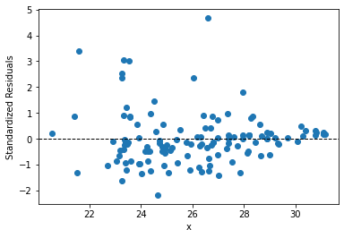
​    


```python
def scatter_resid(col_1):
    
    """
    Break down scatterplots into different years
    """
    
    fig, ax = plt.subplots(1, 2, figsize=(8,4), sharey=True)
    
    ax[0].scatter(x=dset[col_1+"19"], y=std_resid19, alpha=0.4)
    ax[1].scatter(x=dset[col_1+"20"], y=std_resid20, alpha=0.4)

    ax[0].set_title("2019", fontsize=14, fontname="Verdana")
    ax[1].set_title("2020", fontsize=14, fontname="Verdana")
    
    ax[0].axhline(y = 0, color = 'black', linestyle = '--', linewidth = 1)
    ax[1].axhline(y = 0, color = 'black', linestyle = '--', linewidth = 1)
    
    print(col_1)
    print(stats.pearsonr(std_resid19, dset[col_1+"19"]))
    print(stats.pearsonr(std_resid20, dset[col_1+"20"]))
    
    for i in list(range(2)):
        ax[i].set_xlabel(col_1)
        ax[i].set_ylabel("Residual")
```


```python
scatter_resid("lGDP")
scatter_resid("gGDP")
scatter_resid("cpi")
scatter_resid("ltotpop")
scatter_resid("prur")
scatter_resid("lpmanv")
scatter_resid("lpserv")
```

    lGDP
    (-0.0013134211532044714, 0.9883072911292736)
    (0.005206318951894936, 0.9536749403781897)
    gGDP
    (0.009785490638838816, 0.9130524755959806)
    (0.037459742552051624, 0.6758573989626463)
    cpi
    (0.0010644766697441763, 0.9905234000463365)
    (-0.08935426301154548, 0.3177873726782726)
    ltotpop
    (-0.0010154694931416813, 0.9909596719838065)
    (0.003667705091435988, 0.9673561671831085)
    prur
    (0.0009132214612353689, 0.991869913382784)
    (0.011434235118338005, 0.8984755115745292)
    lpmanv
    (0.0021863829115624264, 0.9805369832997183)
    (0.013932887200478413, 0.8764502266134842)
    lpserv
    (-0.0013055649129459818, 0.9883772262686317)
    (-0.000380295045957475, 0.99661432030712)


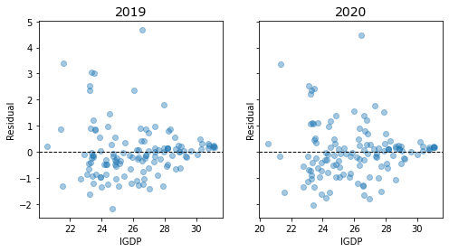
    


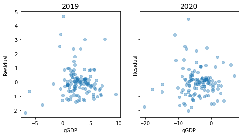
    


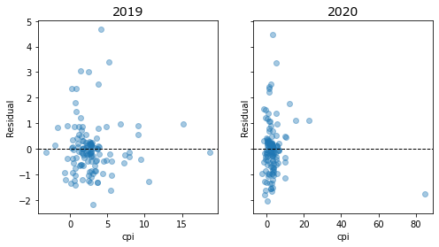
    


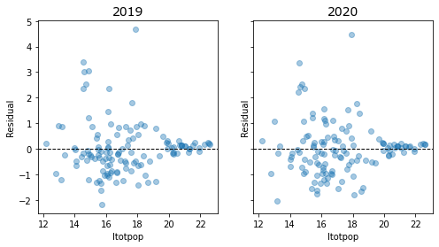
    


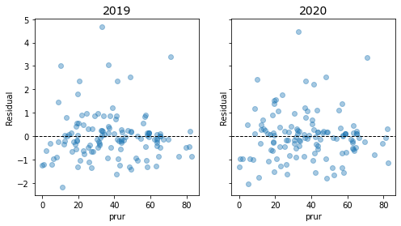
    


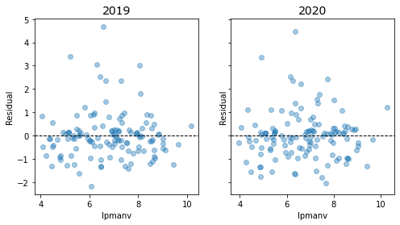
    


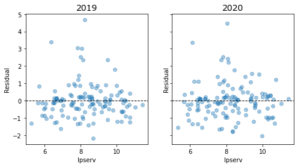
    


```python
cortest = dset.loc[:,['lGDP19','gGDP19','cpi19','ltotpop19','prur19','lpmanv19','lpserv19']]
cortest['std_resid19'] = std_resid19
crrMat = cortest.corr()
print(crrMat)
```

                   lGDP19    gGDP19     cpi19  ltotpop19    prur19  lpmanv19  \
    lGDP19       1.000000 -0.070904 -0.079772   0.855033 -0.166483  0.342336   
    gGDP19      -0.070904  1.000000 -0.093235   0.095691  0.427495 -0.299833   
    cpi19       -0.079772 -0.093235  1.000000   0.090869  0.172876 -0.289869   
    ltotpop19    0.855033  0.095691  0.090869   1.000000  0.254569 -0.173570   
    prur19      -0.166483  0.427495  0.172876   0.254569  1.000000 -0.749861   
    lpmanv19     0.342336 -0.299833 -0.289869  -0.173570 -0.749861  1.000000   
    lpserv19     0.260932 -0.325195 -0.305918  -0.275285 -0.781109  0.949266   
    std_resid19 -0.001313  0.009785  0.001064  -0.001015  0.000913  0.002186   
    
                 lpserv19  std_resid19  
    lGDP19       0.260932    -0.001313  
    gGDP19      -0.325195     0.009785  
    cpi19       -0.305918     0.001064  
    ltotpop19   -0.275285    -0.001015  
    prur19      -0.781109     0.000913  
    lpmanv19     0.949266     0.002186  
    lpserv19     1.000000    -0.001306  
    std_resid19 -0.001306     1.000000  


```python
cortest = dset.loc[:,['lGDP20','gGDP20','cpi20','ltotpop20','prur20','lpmanv20','lpserv20']]
cortest['std_resid20'] = std_resid20
crrMat = cortest.corr()
print(crrMat)
```

                   lGDP20    gGDP20     cpi20  ltotpop20    prur20  lpmanv20  \
    lGDP20       1.000000  0.108832 -0.112325   0.855731 -0.158579  0.344366   
    gGDP20       0.108832  1.000000 -0.233817   0.205857  0.262347 -0.093266   
    cpi20       -0.112325 -0.233817  1.000000   0.010819  0.036621 -0.303645   
    ltotpop20    0.855731  0.205857  0.010819   1.000000  0.253146 -0.168678   
    prur20      -0.158579  0.262347  0.036621   0.253146  1.000000 -0.726935   
    lpmanv20     0.344366 -0.093266 -0.303645  -0.168678 -0.726935  1.000000   
    lpserv20     0.256241 -0.233699 -0.202287  -0.278815 -0.770208  0.944298   
    std_resid20  0.005206  0.037460 -0.089354   0.003668  0.011434  0.013933   
    
                 lpserv20  std_resid20  
    lGDP20       0.256241     0.005206  
    gGDP20      -0.233699     0.037460  
    cpi20       -0.202287    -0.089354  
    ltotpop20   -0.278815     0.003668  
    prur20      -0.770208     0.011434  
    lpmanv20     0.944298     0.013933  
    lpserv20     1.000000    -0.000380  
    std_resid20 -0.000380     1.000000  


```python
resid19 = results19.resid
resid19sq = resid19**2
resid20 = results20.resid
resid20sq = resid20**2
```


```python
dset['const'] = 1
reg19=sm.OLS(endog=resid19sq, exog=dset[['const','lGDP19','gGDP19','cpi19','ltotpop19','prur19','lpmanv19','lpserv19']], missing='drop')
results19=reg19.fit()
print(results19.summary())
```

                                OLS Regression Results                            
    ==============================================================================
    Dep. Variable:                      y   R-squared:                       0.116
    Model:                            OLS   Adj. R-squared:                  0.064
    Method:                 Least Squares   F-statistic:                     2.236
    Date:                Thu, 09 Dec 2021   Prob (F-statistic):             0.0359
    Time:                        04:45:21   Log-Likelihood:                -650.88
    No. Observations:                 127   AIC:                             1318.
    Df Residuals:                     119   BIC:                             1341.
    Df Model:                           7                                         
    Covariance Type:            nonrobust                                         
    ==============================================================================
                     coef    std err          t      P>|t|      [0.025      0.975]
    ------------------------------------------------------------------------------
    const        303.7883     84.390      3.600      0.000     136.688     470.888
    lGDP19       -70.6257     36.105     -1.956      0.053    -142.118       0.867
    gGDP19        -2.6625      1.847     -1.441      0.152      -6.320       0.995
    cpi19         -0.9938      1.423     -0.698      0.486      -3.811       1.824
    ltotpop19     66.1401     35.864      1.844      0.068      -4.874     137.154
    prur19        -0.3606      0.318     -1.134      0.259      -0.990       0.269
    lpmanv19      16.2500      9.949      1.633      0.105      -3.450      35.950
    lpserv19      39.8846     29.843      1.336      0.184     -19.207      98.976
    ==============================================================================
    Omnibus:                      187.839   Durbin-Watson:                   2.122
    Prob(Omnibus):                  0.000   Jarque-Bera (JB):            10881.012
    Skew:                           5.829   Prob(JB):                         0.00
    Kurtosis:                      46.822   Cond. No.                     1.36e+03
    ==============================================================================
    
    Notes:
    [1] Standard Errors assume that the covariance matrix of the errors is correctly specified.
    [2] The condition number is large, 1.36e+03. This might indicate that there are
    strong multicollinearity or other numerical problems.


```python
dset['const'] = 1
reg20=sm.OLS(endog=resid20sq, exog=dset[['const','lGDP20','gGDP20','cpi20','ltotpop20','prur20','lpmanv20','lpserv20']], missing='drop')
results20=reg20.fit()
print(results20.summary())
```

                                OLS Regression Results                            
    ==============================================================================
    Dep. Variable:                      y   R-squared:                       0.143
    Model:                            OLS   Adj. R-squared:                  0.092
    Method:                 Least Squares   F-statistic:                     2.832
    Date:                Thu, 09 Dec 2021   Prob (F-statistic):            0.00914
    Time:                        05:07:24   Log-Likelihood:                -630.30
    No. Observations:                 127   AIC:                             1277.
    Df Residuals:                     119   BIC:                             1299.
    Df Model:                           7                                         
    Covariance Type:            nonrobust                                         
    ==============================================================================
                     coef    std err          t      P>|t|      [0.025      0.975]
    ------------------------------------------------------------------------------
    const        290.6908     76.749      3.788      0.000     138.721     442.661
    lGDP20       -79.3629     37.328     -2.126      0.036    -153.276      -5.449
    gGDP20        -0.8246      0.997     -0.827      0.410      -2.799       1.149
    cpi20         -0.4560      0.453     -1.007      0.316      -1.352       0.440
    ltotpop20     75.2324     37.103      2.028      0.045       1.765     148.700
    prur20        -0.3584      0.259     -1.382      0.169      -0.872       0.155
    lpmanv20      18.7222      8.583      2.181      0.031       1.727      35.717
    lpserv20      46.3854     32.432      1.430      0.155     -17.833     110.604
    ==============================================================================
    Omnibus:                      192.665   Durbin-Watson:                   2.070
    Prob(Omnibus):                  0.000   Jarque-Bera (JB):            13113.393
    Skew:                           6.013   Prob(JB):                         0.00
    Kurtosis:                      51.306   Cond. No.                     1.53e+03
    ==============================================================================
    
    Notes:
    [1] Standard Errors assume that the covariance matrix of the errors is correctly specified.
    [2] The condition number is large, 1.53e+03. This might indicate that there are
    strong multicollinearity or other numerical problems.


```python
dset['const'] = 1
reg19=sm.OLS(endog=dset['unemp19'], exog=dset[['const','lGDP19','gGDP19','cpi19','ltotpop19','prur19','lpmanv19','lpserv19']], missing='drop')
results19=reg19.fit(cov_type = 'HC1')
print(results19.summary())
```

                                OLS Regression Results                            
    ==============================================================================
    Dep. Variable:                unemp19   R-squared:                       0.194
    Model:                            OLS   Adj. R-squared:                  0.147
    Method:                 Least Squares   F-statistic:                     4.144
    Date:                Thu, 09 Dec 2021   Prob (F-statistic):           0.000411
    Time:                        05:13:31   Log-Likelihood:                -359.08
    No. Observations:                 127   AIC:                             734.2
    Df Residuals:                     119   BIC:                             756.9
    Df Model:                           7                                         
    Covariance Type:                  HC1                                         
    ==============================================================================
                     coef    std err          z      P>|z|      [0.025      0.975]
    ------------------------------------------------------------------------------
    const         38.5487     10.194      3.781      0.000      18.569      58.529
    lGDP19        -9.8321      3.385     -2.904      0.004     -16.468      -3.197
    gGDP19        -0.3611      0.268     -1.345      0.179      -0.887       0.165
    cpi19          0.1442      0.109      1.325      0.185      -0.069       0.357
    ltotpop19      9.4730      3.331      2.844      0.004       2.945      16.001
    prur19        -0.0667      0.035     -1.881      0.060      -0.136       0.003
    lpmanv19       1.0411      1.159      0.898      0.369      -1.231       3.313
    lpserv19       6.9725      2.948      2.365      0.018       1.194      12.751
    ==============================================================================
    Omnibus:                       55.977   Durbin-Watson:                   1.875
    Prob(Omnibus):                  0.000   Jarque-Bera (JB):              174.845
    Skew:                           1.656   Prob(JB):                     1.08e-38
    Kurtosis:                       7.698   Cond. No.                     1.36e+03
    ==============================================================================
    
    Notes:
    [1] Standard Errors are heteroscedasticity robust (HC1)
    [2] The condition number is large, 1.36e+03. This might indicate that there are
    strong multicollinearity or other numerical problems.


```python
dset['const'] = 1
reg20=sm.OLS(endog=dset['unemp20'], exog=dset[['const','lGDP20','gGDP20','cpi20','ltotpop20','prur20','lpmanv20','lpserv20']], missing='drop')
results20=reg20.fit(cov_type = 'HC1')
print(results20.summary())
```

                                OLS Regression Results                            
    ==============================================================================
    Dep. Variable:                unemp20   R-squared:                       0.270
    Model:                            OLS   Adj. R-squared:                  0.227
    Method:                 Least Squares   F-statistic:                     5.564
    Date:                Thu, 09 Dec 2021   Prob (F-statistic):           1.46e-05
    Time:                        05:17:33   Log-Likelihood:                -356.48
    No. Observations:                 127   AIC:                             729.0
    Df Residuals:                     119   BIC:                             751.7
    Df Model:                           7                                         
    Covariance Type:                  HC1                                         
    ==============================================================================
                     coef    std err          z      P>|z|      [0.025      0.975]
    ------------------------------------------------------------------------------
    const         48.4946     10.307      4.705      0.000      28.293      68.696
    lGDP20       -12.7050      4.051     -3.137      0.002     -20.644      -4.766
    gGDP20        -0.1995      0.121     -1.652      0.099      -0.436       0.037
    cpi20         -0.1046      0.044     -2.377      0.017      -0.191      -0.018
    ltotpop20     12.3739      4.005      3.090      0.002       4.525      20.223
    prur20        -0.1151      0.030     -3.788      0.000      -0.175      -0.056
    lpmanv20       1.1668      1.046      1.116      0.265      -0.883       3.217
    lpserv20       8.8898      3.428      2.593      0.010       2.171      15.609
    ==============================================================================
    Omnibus:                       39.266   Durbin-Watson:                   1.837
    Prob(Omnibus):                  0.000   Jarque-Bera (JB):               93.674
    Skew:                           1.225   Prob(JB):                     4.56e-21
    Kurtosis:                       6.420   Cond. No.                     1.53e+03
    ==============================================================================
    
    Notes:
    [1] Standard Errors are heteroscedasticity robust (HC1)
    [2] The condition number is large, 1.53e+03. This might indicate that there are
    strong multicollinearity or other numerical problems.


```python

```
