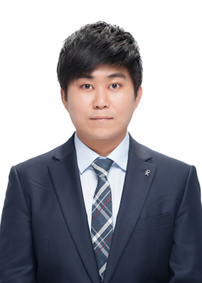
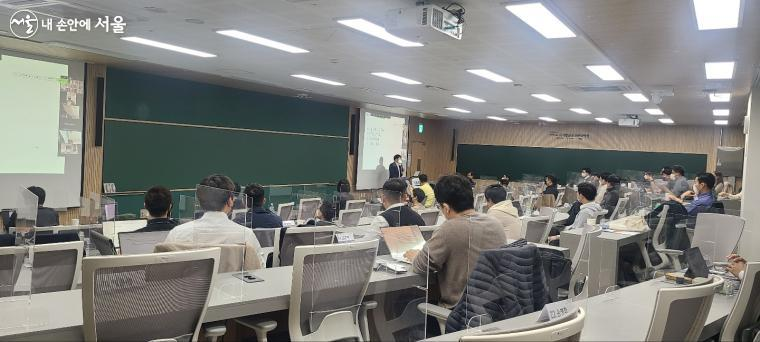
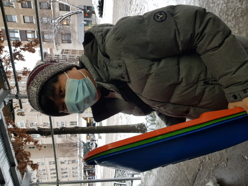
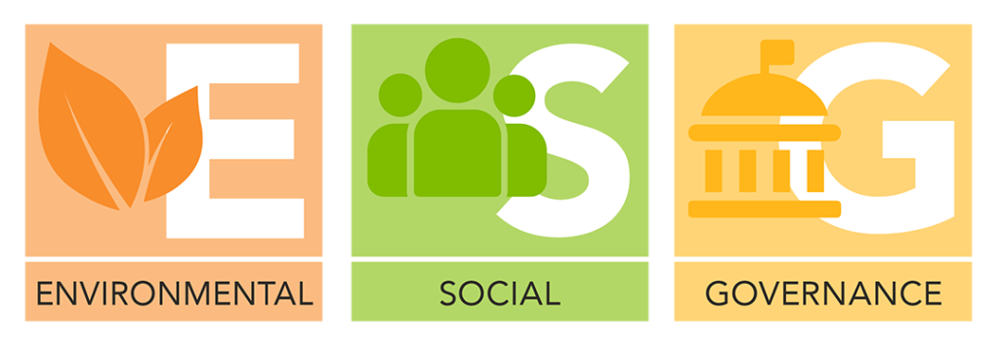
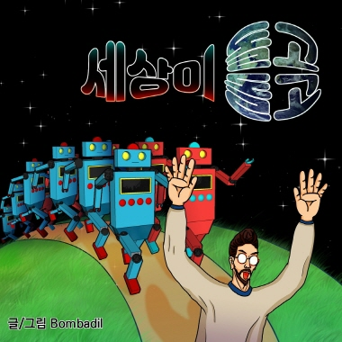
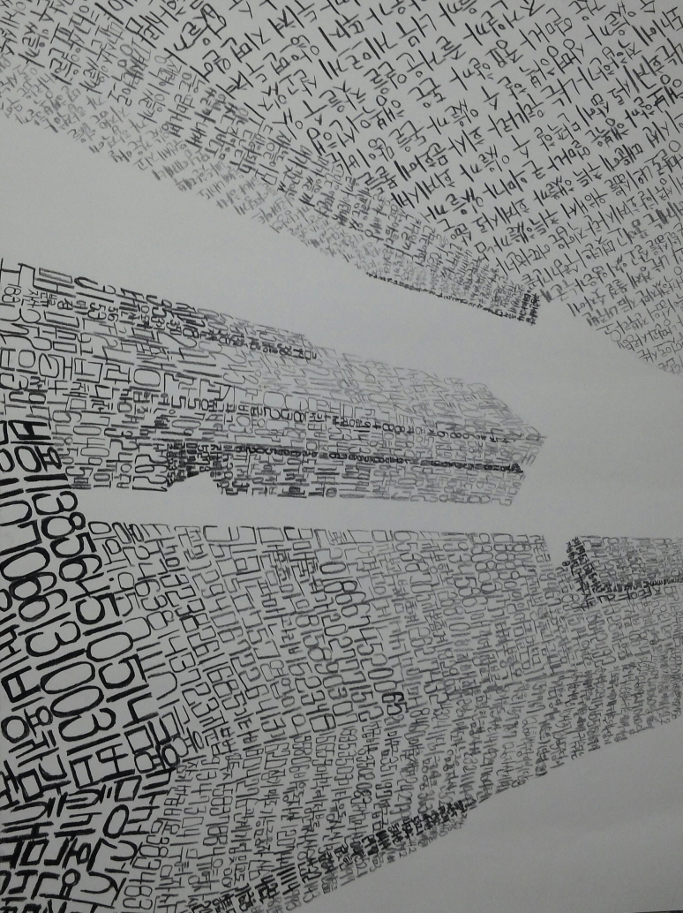

This is the story of how i became the insightful researcher.

## Family Story

Breaking through financial difficulties, I have learned how to overcome hardships in life. The early 2000s was a golden era for my family. My father earned enormous amounts of money from the stock market and was promoted to CFO at his company. However, around the end of middle school, the glory of my family collapsed at once. Being frauded by a neighbor, my parents invested all their savings in a fake business. Moreover, they set the house as collateral to defend the business's bankruptcy. Our house was auctioned by the government as soon as the company fell. After the tragic event, my mother desperately took care of the family economy by privately tutoring children and selling loan products. During my college years, I had to work more than four private tutoring jobs during semesters. Because of my hectic schedule, I could not fully concentrate on my studies. My grades from elective courses were low since I had to focus only on major courses with limited time. I had dinners as cheap as 2 dollars and not nutritious enough. When I got fired, I could not pay the bills on my smartphone and had to live without it.

## Volunteer: Smile Microcredit

Since I went through financial distress, I understand how hard people in poverty sustain their lives and what assistance they need. I realized how worthwhile helping others is through the volunteering experience at Smile Microcredit. Microcredit is a banking service that lends money to self-employed people who cannot lend with market interest because of inferior credit. The job of the volunteers was to introduce and promote the service. At the beginning of the job, I was too shy to explain the products proactively. Supervisor Seok-ki Lee encouraged me by saying, "This activity is not just promotion but helping people in difficulties. Some people need this product but cannot use it because of their unawareness. Please have more responsibility for making our society better.” After the conversation, I learned how important the work was and enthusiastically informed people about the products. People sometimes yelled at me since they misunderstood the product as fraudulent financial services. I was able to understand their aggression generated from negative experiences and approached them more sincerely. 425 hours during three months of volunteering was an intense but precious experience to break through my past status and mindset.

## Became KICPA

Passing the Korean CPA exams proved to me that I can overcome difficulties in learning and comprehending complex theories about accounting, finance, and the economy. Despite financial difficulties and time management disadvantages, I successfully managed my study plans and achieved a CPA certificate. Even though I had to do part-time jobs to cover the costs of video lectures and living expenses, I studied more than eight hours per day for three years. In addition to that, I made sure to acquire insights behind complicated theories rather than merely memorize details, which enhanced the efficiency and effectiveness of my study.

## Intuitive Researcher

Not only did I earn professional knowledge, but I also voluntarily utilized the knowledge to do profound research. I constructed an empirical model of baseball contracts and published research articles. By applying financial theories to baseball statistics, my model successfully predicted values of FA contracts within a ten percent error. Impressed by articles in my private blog, one editor in KB Report proposed an offer to me to write a data analytic article. I investigated how much Korean players outperformed the previous expectations by comparing the performances of Korean top baseball hitters and those of the major league’s top players. My article was posted on the first headline of Daum sports, one of the most renowned portals in South Korea, and ranked 4th in the most-read sports article. Interaction with readers broadened my perspective and was so rewarding that I realized how enjoyable research was to me. I also realized that writing an informative article was not possible if not for the transparently disclosed information on the baseball industry.

## Gold Standard Financial Advisor

Through my experience at EY, I developed insights into financial data and a cooperative attitude. While I was working in the financial advisory division, financial insight was substantial for the quality of analysis. Through reading research reports on industries, I became able to determine the competitiveness of products and competitors of the industries. Constructing a whole package of forecasted financial statements and cash flow schedules for the DCF method, I thoroughly apprehended how each financial statement is systematically linked with valuation projects. With due diligence projects of more than USD 230 million, I acquired analytic skills in financial statements and detecting abnormal changes. Moreover, I deeply perceived that team-up with colleagues is the most substantial for improving performance. Whenever colleagues asked me to help, I supported them as if the problems were mine. I shared my knowledge with coworkers to generate a model fluently linked with their forecasting. My supervisors and managers recognized my cooperative behaviors and the quality of my reports, and thanks to that, I achieved the ‘Gold Standard’, which is the highest rating, several times from peer evaluations.

## Challenge to a broad analytic world

Even though I overcame financial difficulty through working at EY, my solution focuses on individual diligence, not improving the macroeconomic environment to alleviate poverty. As I participated in financial markets as an information provider, I realized that financial markets are an unlevel playing field that gives rich people benefits and creates economic polarization. Rich people who can easily manipulate cutting-edge techniques can immediately detect investment opportunities with vast amounts of profit, whereas people with low incomes barely realize the chances. Additionally, Covid-19 accelerated the discrepancy even further. Wealthy people took advantage of bubble markets, while the middle and lower classes lost jobs and suffered from disease without proper treatment. The complication will be more stringent unless broad social cooperation is made.

Since I went through economic difficulty and sympathize with how difficult it is for people to overcome financial hardship, I want to contribute to mitigating wealth disparity more proactively than accountants can. I believe that making the economic environment impartial to everyone is the fundamental condition to motivate people in financial difficulty to defeat the problem. I want to propose more direct and effective solutions with research that encourages financial decisions to reduce economic disparity.

## Developing Machine Learning Skillsets

Throughout the projects I executed in EY, I confronted difficulties in managing big data and recognized the necessity of state-of-art data analyzing skills. Managing big data with Excel was already an outdated way for global leading companies because of its inefficiency. When I was participating in the Carve-Out project with LG electronics, the data the company had was too massive to manipulate. I split the file into several parts to work with Excel, but the conversion process caused unnecessary procedures. After the experience, I proactively started searching for new possibilities and methods in data management and participated in job training programs at EY. I achieved the EY Badge in Data Science. Through the programs, I learned Bayes' theorem, Bayesian probability theory, and the basic syntax of R in the program. 

I also looked up for external institutions to acquire more knowledge of machine learning and its potential uses. Through Digital Finance Mastership Program: Machine Learning Curriculum at KAIST, I realized that forefront computing skills can help to address complex social problems. The curriculum comprised basic mathematics for machine learning, the theories behind machine learning, and case studies that applied the theories in business. My team achieved an excellence award in the final team project, ‘Incomplete Sales blocking algorithm based on STT(Speech to text) technology.’ We designed an artificial intelligence bot to detect incomplete sales by analyzing speech. The bot can prevent unexpected high insurance expenses by alerting customers when sellers do not mention significant sentences. Our vision of mitigating information inequality was reflected in this bot by protecting customers’ rights. 

Computing skills had been mere tools for financial analysis, but they became tools to envision an equitable society after the KAIST program. I wanted to delve into what technology can do when it meets financial analysis. As a result, I decided to leave EY to pursue a master’s degree in finance at Fordham University.

## Creative life in Fordham University

At Fordham, I became an insightful analyst with high-tech programming techniques, such as machine learning and natural language processing, who can generate creative and incisive analyses of financial issues. A profound curriculum allowed me to improve my intuitions and skillsets and introduced me to critical concepts such as ESG. 

To begin with, through ‘Machine Learning’ class, I acquired skills in building prediction and categorization models based on complex theories such as GARCH, VAR, Random Forest, Neural Networks, etc. I researched which characteristics make companies survive in S&P500 in the long and short terms with ten economic variables. Unlike a general prediction, Random Forest models outperformed Neural Networks models with high accuracy in categorization, and Neural Network models could not generate economic interpretation with high iterations. Moreover, the result, that the dividend rate was the most substantial in long-term survival and the least in short term, was aligned with expectation, whereas another result with highly ranked CAPEX was against common sense that professionals do not consider the long-term investment. However, I could not sufficiently expand my research perspective due to the limited time and computing capacity. The research could be expanded further with significant factors in the inclusion of S&P 500. When sufficient time is allowed, I would train the model to maximize the accuracy of Neural Network models to find out if they can outperform Random Forest models.

Furthermore, I acquired acute knowledge of designing regression research models with multi variables and deducing insights from the variables in a class ‘Financial Econometrics’. The class taught me that well-constructed regression models can provide discerning interpretations of diverse social aspects to researchers. Through research ‘How Covid shifted factors in unemployment for the resilient economy,’ I concluded that the paradigm of unemployment has changed to macroeconomic-derived unemployment after covid. Additionally, the result of the research showed that decentralizing urban areas and decreasing dependency on the service industry are reasonable solutions for reducing unemployment based on the fluctuation of economic variables.

Not bounded by quantitative data, I also expanded my analysis ability even to qualitative data. Quantitative analysis is a long-established approach to judging financial decisions, but it is not enough for discerning the intentions behind the numbers. Qualitative analysis can provide additional evidence such as the magnitude of management’s willingness in plans and the momentum effect on texts. In ‘Computational Finance’ class, I learned how to build a dictionary that addresses research purposes, quantify written information, and analyze the data for financial decisions. I envisioned the ‘ESG Potential Improver Model’ that detects companies with underrated ESG ratings by comparing the numbers of ‘net forward positive words’ to the numbers of ‘net past positive words’, based on sustainability reports. If further conducted with text analysis, the research will reveal the relationship between the prediction of ESG ratings and volunteer disclosures.

Highlights of my academic experience also included a thorough exploration of ESG. ESG classes at Fordham such as ‘ESG and Portfolio Management’ and ‘Sustainable Investing and ESG Analysis’ corrected misunderstandings of ESG and contributed to comprehensively integrating ESG into financial decisions. It encourages investors to recognize ESG issues as systematic risks and enhance ESG performance in their investments. Since the goal of ESG, efficiently allocating wealth to address environmental, social, and governance issues, aligns with my personal mission, of establishing an equitable society with more reasonable financial decisions, I deeply empathize with its value. With a qualitative and critical re-evaluation of MSCI’s ESG rating on Meta, I explained what could have caused the plunge of Meta in the stock market of 2022. It clarified how ESG rating information can affect performance in the stock market, and why corporates should also consider ESG values as well as economic factors.

## Research Assistant in Fordham

I received research training from Professor Svenja Dube and Hye-Seung Lee. I contributed to diverse empirical research related to ESG and volunteer disclosures that are highly related to my research interests. I assisted Professor Svenja’s research about ESG issues and industries’ reactions to it by analyzing how the ratio of words in 10-K disclosures about natural disasters fluctuates as climate change proceeds. I isolated the ‘risk factor’ sections from over a hundred thousand 10-K disclosures with different formats by identifying the data structures. Then, I designed the dictionary addressing the purpose of the research to track the number of words used in the data. The increasing trajectory of words related to ESG issues for ten years showed that more companies were concerned about ESG issues that became a significant risk for their businesses.

Moreover, I participated in the research led by Professor Hye Seung Lee. The research examines whether retail consumers change their shopping behavior in response to negative firm ESG news. I processed and provided the dataset for the premise of the research by following the number of searches and tweets about a company when important events regarding ESG happened to see the consumers’ awareness of the events. I successfully utilized APIs of tweets and google trends data to analyze them with the ESG categorization package made by the BERT algorithm. The analysis was adopted in Professor Lee’s paper as an empirical study.

## Personality

I am a passionate debater with a flexible mind. With various interests and ideas, I enjoy investigating and arguing about problems from diverse angles to figure out the best solutions. I had experiences where a single stimulant expanded to holistic and insightful resolutions. With that, I grew to actively address questions and discourses when I see room for improvement. Dealing with questions and exploring new issues take a large amount of time and effort. However, the research comes out with prestigious quality and novel insights that encourage me to achieve astute and creative perspectives.

Furthermore, I am an indefatigable learner with curiosity as my biggest motivation and inspiration. I grab every possible opportunity of learning new knowledge regardless of how difficult and unfamiliar the concepts of it are. I believe that every piece of knowledge can contribute to improving my insight. Even after I started a stable job as an accountant, I never stopped learning new things. The Machine Learning class covered complicated theories such as GARCH, VAR, Random Forest, Neural Networks, etc., to which I also enthusiastically self-studied with various videos, articles, and papers to go beyond the class, realizing the infinite potential of the theories for applications. I also learned how to create comic series, which enhanced my self-expressing skills and creativity. Moreover, establishing and playing in a rock band as a leader and main singer taught me how to successfully run a team and grow together.

However, I become too argumentative from time to time. In conversations, I tend to focus on discriminating truth from falsehood. While I was spending time with my friends or family and when people mentioned things against the fact, I tended to correct or disagree with the facts argumentatively. The arguments damaged friendships or relationships in families, by hurting their feelings or misunderstanding the intentions. Through the experience, I learned a priceless lesson that there are more crucial values in life than blindly pursuing the truth. 

To overcome my shortcomings, I try to approach the words and situations of others from more diversified perspectives. I am reading articles and papers on different topics to experience as much as possible. Moreover, I try to expose myself to groups of people with various cultural and intellectual backgrounds to deepen my understanding of people. With that, I listen attentively to the words of others to apprehend their intention, rather than the superficial rights or wrongs. True appreciation of the conversation is not gained from merely acquiring knowledge but from understanding and apprehending people’s ideas.

## Research Interest

I believe that the more transparent information is, the more reasonable financial decisions people can make, and the improved decisions will make society more sustainable. My research goal is mitigating information inequality to allow people to make more reasonable financial decisions. Moreover, my research will contribute to integrating ESG issues into financial decisions. I trust that research about the relationship between transparent ESG information and financial decision encourages societies to proactively overcome environmental and social problems.

Information disparity can trigger serious economic problems for people in an inferior information environment. My parents were frauded by a neighbor who proposed a business in semiconductor industry. Since my parents did not have enough information about the industry in 2005, they had to rely on their networks and the swindler. As a result, they lost all their money because the production yield was too low to be lucrative, and a huge additional investment was required to improve the yield rate. The swindler who already knew that the business could not work appropriated company’s money and disappeared while my parents suffered from large number of debts. My family’s huge failure allowed me to realize how transparent information is substantial for financial decisions. If my parents had sufficient information about the business, they would not invest money in the business and my family would not have to go through financial difficulties. Therefore I developed a passion to improve the financial system so that people can access accurate and thorough information.

Various types of information inequalities exist and distract efficient wealth allocation among economic units. I especially want to focus on the distortion of information. Even though information providers produce a variety of data, the information will distract users’ financial decisions if the data has too many errors. While I worked at EY as an information provider, I experienced diverse situations where information providers generate many distortions in their products.

Distortion of information can occur when the revision of accounting standards does not holistically reflect the following reactions. My research will unfold how the modification impact accounting and financial evaluation and suggest how to mitigate the noise. When I was in charge of the CGU impairment test and fair value evaluation for Lotte Asset Development, IFRS lease accounting standard was updated as all lease assets and debts should be recorded regardless of capital or operating lease. The issue of the conversion was the drastic plummet of the value of companies that decidedly relied on operating leases, even though lease-related cash flows were stable. The fallen values generated by errors in evaluation could provide an inaccurate signal to information users. When Terminal Value was calculated, previous valuation models assumed that the amount of depreciation and CAPEX will be the same after the last forecasted year. However, the assumption was too disadvantageous for companies in a stable industry. I enlarged forecasting periods for assets to be sufficiently realized as depreciation costs. I want to research how the revision of accounting standards triggers misinterpretation. To identify the effect of distortion, I will use big data scrapping and quantitative analysis techniques. With the relationship between the distortion and the modification, the research will allow accounting standards boards to edit their standards with clear objectives, and information users can improve adaptability to additional revision.

Distortion in information also exists when extreme events happen. I want to research how significant events on information providers can trigger noise in information. My previous director at Ernst & Young, Sun-Yeob Kim, was investigated by public prosecutors because he was suspected of intentionally overvaluing Samsung Bioepis. Starting from the investigation, surveillance to valuation results became stricter. Auditors started meticulously tackling valuation models' assumptions. As a result, valuation specialists tended to follow the previous assumptions and conservatively predicted target companies’ performance. In my perspective, overall valuation results decreased regardless of the profitability of companies. Although decreased values are caused by the surveillance, information users can interpret the drop as a slump in the business models. With the errors, investors can divest undervalued companies, which exaggerates devaluation. I will conduct research on the relationship between substantial events in accounting and distortion in information. For the analysis of events, the events can be categorized by their extremity. I can reveal how categorized events affect audit results and information user’s reactions. Through the research, auditors can effectively reduce errors, and users can reasonably expect the results of the events.

Distortion in information is also a substantial issue in ESG. I am passionate about research on the validity of ESG. Stakeholders have the right to know the relationship between the companies and the environment, and society under their governance. As the extent of the requests for ESG information has intensified, governments started regulating companies to reveal ESG data. Environmentally, following TCFD guidance, SEC proposed new rules for disclosures that companies should report the climate risks of the company and their managerial reaction to them. Also, socially, under the pay transparency law, companies in California, Washington, Colorado, and NYC should disclose the range of wages in job postings.

However, ESG is facing many obstacles. One of the most considerable problems in ESG is Greenwashing, which delivers false signals to information users. Many ESG evaluations rely on pledges or advertisements to improve ESG performance. Some companies take advantage of this loophole to promise enhancement and execute nothing. Investors who fall for the vacant words can misinterpret the future ESG performance of companies, which causes inefficiency in wealth allocation. As a result, Greenwashing ruins motivation to comply with ESG policies and triggers distortion in ESG data.

Professor Hakkon Kim and his colleagues (2020, A Study on Determinants of Loan Repayment in Peer-to-Peer Lending) concluded that the more specified plans were in the debtors' proposals, the higher the possibility debtors would repay their loans. Similarly, I can also presume that the more detailed plans and quantitative evidence exist, the higher the possibility companies improve their ESG performance. Text analysis and profound understanding in ESG issues are required to achieve worthwhile results of the research. Based on the results, my research will identify patterns of reliable pledges based on qualitative and quantitative analysis. The research can provide information users to the tool how to interpret companies’ pledges. Moreover, as the users correctly price companies’ pledge, companies will not falsely promise improvement of ESG issues, so the research can contribute to mitigating Greenwashing.

## Diversity in my life

Most of all, I can contribute to amplifying classmates’ perspectives toward economic inequality. In my childhood, my parents were frauded by a neighbor and invested all their savings in a fake business. We lost all our financial resources, including our house. After the tragic event, my mother desperately cared for the family economy by working multiple jobs. During my college years, I had to work more than four private tutoring jobs during semesters, sacrificing my time and energy to study. If it were not for the subsidies from the government and university, I could not have finished my undergraduate and overcome economic hardships. My personal experience helped me to understand how financial structures and systems of society can affect and help individuals.

Furthermore, with four years of experience at EY in data analysis, I am equipped to help classmates improve their knowledge in Accounting, Finance, Economy, and ESG and techniques in various data tools. I acquired a Korean CPA licensure and worked at EY for four years in the Valuation team that simultaneously dealt with Accounting and Financial issues. Additionally, I accomplished various achievements such as a CFA ESG Investing certificate, programming languages training, and mathematics-related certificates. Not only can I fluently construct categorization or prediction models with machine learning, but also, I can delicately handle data tools such as Excel, Bloomberg terminal, and Capital IQ at the professional level. 

In addition, I have successful experience in investment. Even though I earned more than USD 60,000 yearly, the wage was not enough to compensate for the tuition and living costs in New York. I had to find another way to make money. Since I started investing money in the stock markets in 2017, I have earned more than USD 80,000 because I have a better understanding of the financial system and the behaviors of market participants. I am eager to intercommunicate my professional insights into financial issues and previous experience in retail investment.

My cultural background will convey a supportive atmosphere in the program, too. I am from South Korea, and Korean society has a relation-oriented culture. Therefore, I significantly count on the interaction between members of the community. I believe that exchanging each other’s cultural and intellectual heritage will make the Ph.D. experience richer and improve overall performance in the program. At Fordham, I voluntarily shared my academic knowledge with my classmates. In my weekly study group, I taught essential concepts from statistics and mathematics to assumptions of the multi-variable regression models. It was rewarding that my classmates eventually understood complex concepts and successfully finished the projects with my support. In addition, while doing a research assistantship with Professor Svenja, I made instructions for handling the Bloomberg Add-in and data, from installation to building functions. With the instruction, another research assistant who helped with data scrapping could easily handle the Bloomberg add-in and construct an excellent-quality dataset. Through these experiences, I realized how valuable cooperative environments are for the research and academic community.

